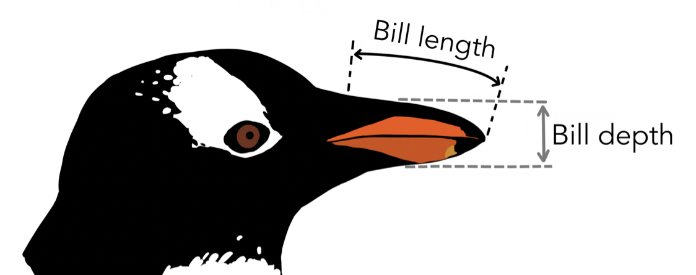

```{r setup, include=FALSE}
library(tidyverse)
library(palmerpenguins)
library(babynames)
library(gapminder)
library(gganimate)
library(plotly)
library(gifski)
options(htmltools.dir.version = FALSE)
options(htmltools.preserve.raw = FALSE)
knitr::opts_chunk$set(fig.retina = 3, fig.align = 'center', warning = FALSE, message = FALSE)
```

```{r xaringan-themer, include=FALSE, warning=FALSE}

library(xaringanthemer)
style_mono_accent(
  base_color = "#1c5253",
  # header_font_google = google_font("Josefin Sans"),
  header_font_google = google_font("Itim"),
  text_font_google   = google_font("Roboto Slab", "300", "300i"),
  # code_font_google   = google_font("Fira Mono")
  code_font_google   = google_font("Source Code Pro")
)
```


# Sobre el curso...

- Enfoque práctico.

# Objetivos:

1. Conocer la filosofía **grammar of graphics**
1. Manejar `R` utilizando el IDE `RStudio` 
1. Utilizar paquetes para visualización de datos 
  1. `ggplot2`
  1. `patchwork`
  1. `plotly`
  1. `gganimate`

---

# Grammar of graphics

- Aproximación teórica sobre como construir gráficos [1]
- Muchos programas: ggplot, tableau, vega-lite
- No se centra en
  - el tipo de gráfico que es mejor en función del tipo de datos
  - el aspecto visual del gráfico
  - el algoritmo necesario para definir el gráfico
- Sí se centra en el mecanismo. ¿Cómo diseñar el sistema que nos permite construir el gráfico?

.footnote[[1] [https://www.springer.com/gp/book/9780387245447](https://www.springer.com/gp/book/9780387245447)]

---

# Grammar of graphics


---

# Herramientas: `ggplot2`

- Grammar of graphics es un sistema de diseño, `ggplot2` es una implementación.
- Teoría y práctica son diferentes - algunas de las capas pueden mapearse juntas.

### Instalación y carga del paquete en R

```{r eval=FALSE}
install.packages("ggplot2")
library(ggplot2)
```

---

# ¿Qué datos vamos a visualizar?

Ejemplos de gráficos según el tipo de variables

- Numéricos
  - Una variable: histográma 
  - Dos variables: gráficos de dispersión
- Categóricos
  - Una variable: Gráfico de barras
  - Dos varaibles: Gráfico de barras coloreado
- Numéricos y categóricos
  - Gráfico de dispersión coloreado
  - Gráfico de cajas separado por categorías
  ...

.footnote[Para una clasificación detallada puedes consultar: https://www.data-to-viz.com]

---

# Tipos de datos en `R`

- Variables continuas:
  - Números enteros `int`
  - Números decimales `dbl`
  - En general, `num`
- Variables discretas: 
  - Factores `fct`
  - Factores ordenados `ord`

Otros tipos:

- `NA` (not available). El dato no está disponible.
- `NaN` (not a number). Se esperaba un dato numérico pero el que hay no lo es.
- `NULL` - nada. 

---

#  Datos: `penguins` 🐧 

```{r eval=FALSE}
install.packages("palmerpenguins")
palmerpenguins::penguins
```

Datos de 344 pingüinos de  3 especies diferentes, recogidos de 3 islas del Archipelago Palmer, Antárctica.

- `species           ` : Adelie, Chinstra, Gentoo. Tipo `fct` 
- `island            ` : Biscoe, Dream, Torgersen. Tipo `fct` 
- `bill_length_mm    ` : Longitud del pico. Tipo `dbl` 
- `bill_depth_mm     ` : Profundidad del pico. Tipo `dbl` 
- `flipper_length_mm ` : Longitud de la aleta. Tipo `int` 
- `body_mass_g       ` : Peso. Tipo `int` 
- `sex               ` : Sexo. Tipo `fct` 
- `year              ` : Año (2007, 2008, 2009). Tipo `int` 


---

# Pingüinos 🐧

```{r echo=FALSE, tidy=FALSE}
rmarkdown::paged_table(penguins)
```


---

# Visualizaciones para una sola variable categórica

- Gráfico de barras para contar el número de pingüinos estudiados en cada isla

.pull-left[
```{r echo=FALSE, fig.height=4}
ggplot(data = penguins, aes(x = island)) + stat_count()
```


```{r eval=FALSE, include=TRUE}
ggplot(data = penguins, 
       aes(x = island)) + 
  stat_count()
```
]

--

.pull-right[
```{r echo=FALSE, fig.height=4}
ggplot(data = penguins, 
       aes(x = island)) + 
  geom_bar()
```


```{r eval=FALSE, include=TRUE}
ggplot(data = penguins, 
       aes(x = island)) + 
  geom_bar()
```
]

---

# Visualizaciones para una sola variable numérica: Histograma


```{r echo=FALSE, fig.height=4}
ggplot(penguins, aes(bill_length_mm)) +
  geom_histogram()
```

--

```{r eval=FALSE, include=TRUE}
ggplot(data = penguins, aes(x = bill_length_mm)) +
  geom_histogram()
```

---
class: middle, center, inverse

# Ejercicios

---

#  Datos: `diamonds` 💎 

```
ggplot2::diamonds
```

Datos sobre los precios y otros atributos de de 53940 diamantes. 

- `carat   `: peso del diamante `dbl`
- `cut     `: calidad del corte (Fair, Good, Very Good, Premium, Ideal) `ord`
- `color   `: colour, desde D (best) hasta J (worst)`ord`
- `clarity `: medida de cómo de claro es el diamante (I1 (worst), SI2, SI1, VS2, VS1, VVS2, VVS1, IF (best)) `ord`
- `depth   `: porcentaje total de profundidad 2 * z / (x + y) `dbl`
- `table   `: width of top of diamond relative to widest point `dbl`
- `price   `: precio en dolares estadonidenses `int`
- `x       `: longitud en mm `dbl`
- `y       `: ancho en mm `dbl`
- `z       `: profundidad en mm `dbl`

---

#  Diamantes 💎

```{r echo=FALSE, tidy=FALSE}
rmarkdown::paged_table(diamonds)
```

---

# Ejercicios

.pull-left[
```{r echo=FALSE, fig.height=4}
ggplot(data = diamonds, 
       aes(x = cut)) +
  stat_count()
```
]

.pull-right[
```{r echo=FALSE, fig.height=4}
ggplot(data = diamonds, 
       aes(x = clarity)) + 
  stat_count()
```
]

---

# Soluciones

.pull-left[
```{r echo=FALSE, fig.height=4}
ggplot(data = diamonds, aes(x = cut)) +
  stat_count()
```

```
ggplot(data = diamonds, 
        aes(x = cut)) +
  stat_count() 
```

]

.pull-right[
```{r echo=FALSE, fig.height=4}
ggplot(data = diamonds, aes(x = clarity)) +
  stat_count()
```

```
ggplot(data = diamonds, 
        aes(x = clarity)) +
  stat_count()
```
]


---
class: center, middle

# Visualizaciones para dos variables numéricas

## Gráficos de dispersión
 
y además modificaciones de la estética

---

#  Datos: `penguins` 🐧 




---

# Gráfico de dispersión

```{r echo=FALSE, fig.height=4}
ggplot(data = penguins, aes(x = bill_length_mm, y = bill_depth_mm)) +
  geom_point()
```

--

```{r eval=FALSE, include=TRUE}
ggplot(data = penguins, aes(x = bill_length_mm, y = bill_depth_mm)) +
  geom_point()
```

--

O también:

```{r eval=FALSE, include=TRUE}
ggplot(penguins, aes(bill_length_mm, bill_depth_mm)) + #<<
  geom_point()
```

---

## Color 🎨

```{r echo=FALSE, fig.height=4}
ggplot(penguins, aes(bill_length_mm, bill_depth_mm)) +
  geom_point(color = "blue")
```

--

```{r eval=FALSE, include=TRUE}
ggplot(penguins, aes(bill_length_mm, bill_depth_mm)) +
  geom_point(color = "blue") #<<
```

--

Colores por defecto disponibles: http://sape.inf.usi.ch/quick-reference/ggplot2/colour 

---

## Color personalizado 🧑‍🎨

```{r echo=FALSE, fig.height=4}
ggplot(penguins, aes(bill_length_mm, bill_depth_mm)) +
  geom_point(color = "#fabada")
```

--

```{r eval=FALSE, include=TRUE}
ggplot(penguins, aes(bill_length_mm, bill_depth_mm)) +
  geom_point(color = "#fabada") #<<
```

Para encontrar más colores: [https://coolors.com](https://coolors.com)

---

## Solapando `geom`s

```{r echo=FALSE, fig.height=4}
ggplot(penguins, aes(bill_length_mm, bill_depth_mm)) +
  geom_point(color = "#fabada") +
  geom_hline(yintercept = 15.2) 
```

--

```{r eval=FALSE, include=TRUE}
ggplot(penguins, aes(bill_length_mm, bill_depth_mm)) +
  geom_point(color = "#fabada") +
  geom_hline(yintercept = 15.2) #<<
```

---

## Solapando `geom`s

```{r echo=FALSE, fig.height=4}
ggplot(penguins, aes(bill_length_mm, bill_depth_mm)) +
  geom_point(color = "#fabada") +
  geom_hline(yintercept = 15.2) +
  geom_vline(xintercept = 43) 
```

--

```{r eval=FALSE, include=TRUE}
ggplot(penguins, aes(bill_length_mm, bill_depth_mm)) +
  geom_point(color = "#fabada") +
  geom_hline(yintercept = 15.2) +
  geom_vline(xintercept = 43) #<<
```

---

## Solapando `geom`s

```{r echo=FALSE, fig.height=4}
ggplot(penguins, aes(bill_length_mm, bill_depth_mm)) +
  geom_point(color = "#fabada") +
  geom_hline(yintercept = 15.2, color = "red", linetype = "dotted") +  
  geom_vline(xintercept = 43, color = "grey", linetype = "dashed")  
```

--

```{r eval=FALSE, include=TRUE}
ggplot(penguins, aes(bill_length_mm, bill_depth_mm)) +
  geom_point(color = "#fabada") +
  geom_hline(yintercept = 15.2, color = "red", linetype = "dotted") +  #<<
  geom_vline(xintercept = 43, color = "grey", linetype = "dashed")  #<<
```

Puedes encontrar un resumen de todos los tipos de línea [aquí](http://www.sthda.com/english/wiki/ggplot2-line-types-how-to-change-line-types-of-a-graph-in-r-software).

---

## Rectas genéricas

```{r echo=FALSE, fig.height=4}
ggplot(penguins, aes(bill_length_mm, bill_depth_mm)) +
  geom_point(color = "#fabada") +
  geom_abline(slope = .3, intercept = 2)
```

--

```{r eval=FALSE, include=TRUE}
ggplot(penguins, aes(bill_length_mm, bill_depth_mm)) +
  geom_point(color = "#fabada") +
  geom_abline(slope = .3, intercept = 2) #<<
```

---

## Cuidado con el tamaño ☝🏻

```{r echo=FALSE, fig.height=4}
ggplot(penguins, aes(bill_length_mm, bill_depth_mm)) +
  geom_point(color = "#fabada") +
  geom_abline(slope = .3, intercept = 2, size = 2) 
```

--

```{r eval=FALSE, include=TRUE}
ggplot(penguins, aes(bill_length_mm, bill_depth_mm)) +
  geom_point(color = "#fabada") +
  geom_abline(slope = .3, intercept = 2, size = 2) #<<
```

---

## El orden de las capas también importa

```{r echo=FALSE, fig.height=4}
ggplot(penguins, aes(bill_length_mm, bill_depth_mm)) +
  geom_abline(slope = .3, intercept = 2, size = 2) + #<<
  geom_point(color = "#fabada") #<<
```

--

```{r eval=FALSE, include=TRUE}
ggplot(penguins, aes(bill_length_mm, bill_depth_mm)) +
  geom_abline(slope = .3, intercept = 2, size = 2) + #<<
  geom_point(color = "#fabada") #<<
```

---

## Mapeando variables como `color`

```{r echo=FALSE, fig.height=4}
ggplot(penguins, aes(bill_length_mm, bill_depth_mm, color = sex)) + #<<
  geom_point()
```

--

```{r eval=FALSE, include=TRUE}
ggplot(penguins, aes(bill_length_mm, bill_depth_mm, color = sex)) + #<<
  geom_point()
```

---

## Aesthetic vs. apariencia ⚠️


```{r fig.height=2}
ggplot(penguins, aes(bill_length_mm, bill_depth_mm)) +
  geom_point(color = "blue") #<<
```


```{r fig.height=2}
ggplot(penguins, aes(bill_length_mm, bill_depth_mm, color = sex)) + #<<
  geom_point()
```

---

## Personalizando la escala de colores 🖼️

```{r fig.height=4}
ggplot(penguins, aes(bill_length_mm, bill_depth_mm, color = sex)) +
  geom_point() +
  scale_color_manual(values = c("green", "orange")) #<<
```

[Aquí](http://www.sthda.com/english/wiki/ggplot2-colors-how-to-change-colors-automatically-and-manually) puedes encontrar más ejemplos, así como paletas de colores ya predefinidas en R.

---

# Paletas predeterminadas 🎨

```{r, echo=FALSE, fig.height=4}
knitr::include_graphics("./imgs/paletas.png")
```

---

# Paletas predeterminadas 🎨

```{r echo=FALSE, fig.height=4}
ggplot(penguins, aes(bill_length_mm, bill_depth_mm, color = sex)) +
  geom_point() + 
  scale_color_brewer(palette="Dark2")
```

--

```{r eval=FALSE, include=TRUE}
ggplot(penguins, aes(bill_length_mm, bill_depth_mm, color = sex)) +
  geom_point() + 
  scale_color_brewer(palette="Dark2") #<<
```

---

# También hay otros paquetes 🧑‍🎨

```{r}
# install.packages("wesanderson")
library(wesanderson)
```

```{r}
names(wes_palettes)
```

---

# También hay otros paquetes 🧑‍🎨

```{r echo=FALSE, fig.height=4}
ggplot(penguins, aes(bill_length_mm, bill_depth_mm, color = sex)) +
  geom_point() + 
  scale_color_manual(values=wes_palette(n=3, name="GrandBudapest1")) 
```

--

```{r eval=FALSE, include=TRUE}
ggplot(penguins, aes(bill_length_mm, bill_depth_mm, color = sex)) +
  geom_point() + 
  scale_color_manual(values=wes_palette(n=3, name="GrandBudapest1")) #<<
```

---

## Utilizando condiciones para colorear

```{r echo=FALSE, fig.height=5}
ggplot(penguins, aes(bill_length_mm, bill_depth_mm, 
                     color = body_mass_g > 4000)) + 
  geom_point()
```

--

```{r eval=FALSE, include=TRUE}
ggplot(penguins, aes(bill_length_mm, bill_depth_mm, 
                     color = body_mass_g > 4000)) + #<<
  geom_point()
```

---

## Más aesthetics: `shape`

```{r echo=FALSE, fig.height=4}
ggpubr::show_point_shapes()
```

Por defecto, la shape utilizada es la número 16.

- Algunas tienen solo `color`, que rellena el interior de la forma.
- Otras tienen `color` para el borde y `fill` para su interior.

---

## Más aesthetics: `shape`

```{r echo=FALSE, fig.height=4}
ggplot(penguins, aes(bill_length_mm, bill_depth_mm)) +
  geom_point(shape = 17) 
```

--

```{r eval=FALSE, include=TRUE}
ggplot(penguins, aes(bill_length_mm, bill_depth_mm)) +
  geom_point(shape = 17) #<<
```

---

## De nuevo, aesthetic vs. apariencia ⚠️

```{r echo=FALSE, fig.height=4}
ggplot(penguins, aes(bill_length_mm, bill_depth_mm, 
                     shape = island)) + #<<
  geom_point()
```

--

```{r eval=FALSE, include=TRUE}
ggplot(penguins, aes(bill_length_mm, bill_depth_mm, 
                     shape = island)) + #<<
  geom_point()
```

---

## También podemos combinarlas

```{r echo=FALSE, fig.height=4}
ggplot(penguins, aes(bill_length_mm, bill_depth_mm, 
                     shape = island, color = sex)) + #<<
  geom_point()
```

--

```{r eval=FALSE, include=TRUE}
ggplot(penguins, aes(bill_length_mm, bill_depth_mm, 
                     shape = island, color = sex)) + #<<
  geom_point()
```

---

## Diferencia entre color y fill

Vamos a elegir una de las formas con contorno:

```{r fig.height=4}
ggplot(penguins, aes(bill_length_mm, bill_depth_mm)) +
  geom_point(shape = 23)
```

---

## Diferencia entre color y fill

.pull-left[
```{r echo=FALSE, fig.height=4}
ggplot(penguins, aes(bill_length_mm, bill_depth_mm, 
                     color = sex)) + #<<
  geom_point(shape = 23)
```

--

```{r eval=FALSE, include=TRUE}
ggplot(penguins, 
       aes(bill_length_mm, 
           bill_depth_mm, 
           color = sex)) + #<<
  geom_point(shape = 23)
```


]

.pull-right[
```{r echo=FALSE, fig.height=4}
ggplot(penguins, aes(bill_length_mm, bill_depth_mm, 
                     fill = sex)) + #<<
  geom_point(shape = 23)
```

--

```{r eval=FALSE, include=TRUE}
ggplot(penguins, 
       aes(bill_length_mm, 
           bill_depth_mm, 
           fill = sex)) + #<<
  geom_point(shape = 23)
```
]

---

## Diferencia entre color y fill

```{r fig.height=4}
ggplot(penguins, aes(bill_length_mm, bill_depth_mm, 
                     color = island, fill = sex)) + #<<
  geom_point(shape = 23)
```

Poder, se puede pero... 🥴

---

## Otra aesthetic: `size`

```{r echo=FALSE, fig.height=4}
ggplot(penguins, aes(bill_length_mm, bill_depth_mm, size = island)) +
  geom_point(color = "blue")
```

--

```{r eval=FALSE, include=TRUE}
ggplot(penguins, aes(bill_length_mm, bill_depth_mm, 
                     size = island)) + #<<
  geom_point(color = "blue")
```

---

# El valor de `alpha`

Habitualmente cuando trabajamos con `size` los puntos se solapan

```{r echo=FALSE, fig.height=4}
ggplot(penguins, aes(bill_length_mm, bill_depth_mm, size = island)) +
  geom_point(color = "blue", alpha = .4)
```

--

```{r eval=FALSE, include=TRUE}
ggplot(penguins, aes(bill_length_mm, bill_depth_mm, size = island)) +
  geom_point(color = "blue", alpha = .4) #<<
```

---

# La aesthetic `alpha`

```{r echo=FALSE, fig.height=4}
ggplot(penguins, aes(bill_length_mm, bill_depth_mm, 
                     size = island,
                     alpha = island)) + #<<
  geom_point(color = "blue")
```

--

```{r echo=TRUE, include=FALSE}
ggplot(penguins, aes(bill_length_mm, bill_depth_mm, 
                     size = island,
                     alpha = island)) + #<<
  geom_point(color = "blue")
```

Observa cómo se unifican las leyendas al mapear la misma variable en dos aesthetics.

---

# Resumen

.pull-left[
## `geom_`

- `geom_bar()`
- `geom_point()`
- `geom_hline()`
- `geom_vline()`
- `geom_abline()`
]

.pull-right[
## aesthetics

Pueden ser mapeadas en `aes()` en función de una variable o en general para una `geom`.

- `color`
- `fill`
- `alpha`
- `size`
]

---

# Almacenando un objeto

```{r fig.height=4}
p <- ggplot(penguins, aes(bill_length_mm, bill_depth_mm)) +
  geom_point(color = "blue")
p
```

Ahora el objeto `p` está disponible para hacer cualquier tipo de modificación.

---

```{r}
p + labs(title="Relación bill_depth/bill_length en mm")
```

---

# Temas

El paquete tiene temas predefinidos que permiten modificaciones rápidas del aspecto visual.

- `theme_grey`
- `theme_bw`
- `theme_linedraw`
- `theme_light`
- `theme_dark`
- `theme_minimal`
- `theme_classic`
- `theme_void`

---

.pull-left[

```{r fig.height=4}
p + theme_grey()
```

```{r fig.height=4}
p + theme_linedraw()
```


]

.pull-right[

```{r fig.height=4}
p + theme_bw()
```

```{r fig.height=4}
p + theme_light()
```

]

---


.pull-left[

```{r fig.height=4}
p + theme_dark()
```

```{r fig.height=4}
p + theme_classic()
```


]

.pull-right[

```{r fig.height=4}
p + theme_minimal()
```

```{r fig.height=4}
p + theme_void()
```

]

Puedes encontrar más información sobre los temas [aquí](https://ggplot2.tidyverse.org/reference/ggtheme.html).

---

# Otros paquetes que traen temas predeterminados

```{r eval=FALSE}
library(hrbrthemes)
```

---

# Modificar algunos aspectos del tema

```
ggplot(penguins, aes(bill_length_mm, fill = sex)) +
  geom_histogram(alpha = .6, color = "black") +
  theme_ipsum()
```

--- 

# Valores continuos en `size`

```{r fig.height=5}
ggplot(penguins, aes(bill_length_mm, bill_depth_mm, size = year)) +
  geom_point(color = "blue")
```

---

# Forzar una variable a ser discreta

Ahora queremos dar tamaño a los puntos en función del año en el que fueron recogidos los datos.

Si recordamos la tabla de pingüinos, la variable año es numérica.

Pero sabesmo que solo hay tres años. Para forzar a que esta variable sea categórica podemos utilizar `as.factor()`

---

## Forzar una variable a ser discreta

```{r echo=FALSE, fig.height=5}
ggplot(penguins, aes(bill_length_mm, bill_depth_mm, size = as.factor(year))) +
  geom_point(color = "blue")
```

--

```{r eval=FALSE, include=TRUE}
ggplot(penguins, aes(bill_length_mm, bill_depth_mm, size = as.factor(year))) +
  geom_point(color = "blue")
```

---

## Modificar el título de la leyenda

Ahora el título de la leyenda muestra el código que hemos utilizado. ¿Cómo podemos cambiarlo?

.pull-left[
```{r echo=FALSE, fig.height=5}
ggplot(penguins, aes(bill_length_mm, bill_depth_mm, size = as.factor(year))) +
  geom_point(color = "blue")
```
]

.pull-right[
```{recho=FALSE, fig.height=5}
ggplot(penguins, aes(bill_length_mm, bill_depth_mm, size = as.factor(year))) +
  geom_point(color = "blue") +
  labs(size = "Año")
```
]

---

## Variable discreta en el eje x

Hasta ahora hemos trabajado con variables continuas en ambos ejes. ¿Qué pasa si utilizamos una variable discreta con `geom_point()`? Utilizando body_mass_g para obtener lo siguiente

```{r echo=FALSE, fig.height=4}
ggplot(penguins, aes(species, body_mass_g)) +
  geom_point()
```

--

```{r eval=FALSE, include=TRUE}
ggplot(penguins, aes(species, body_mass_g)) + #<<
  geom_point()
```

---

## Colorear utilizando una variable continua

Hasta ahora hemos trabajado con variables discretas para el color. ¿Qué pasa si utilizamos una variable continua? 

```{r fig.height=4}
ggplot(penguins, aes(species, body_mass_g, color = body_mass_g)) +
  geom_point()
```

---

## ¿Qué ocurre con `shape`?

Para shape también hemos utilizado solo variables discretas, ¿qué pasa si intentamos poner una continua?

---

# Color con variable discreta

Ya conocemos esta forma de colorear utilizando una variable discreta:

```{r fig.height=4}
ggplot(penguins, aes(species, body_mass_g, color = species)) +
  geom_point()
```

--

En esta representación los puntos quedan muy solapados, podemos añadir algo de aleatoreidad en el eje $x$ para cambiar la representación.

---

# Añadiendo jitter

```{r fig.height=4}
ggplot(penguins, aes(species, body_mass_g, color = species)) +
  geom_jitter(height = 0)
```

---

# Estadística

```{r fig.height=4}
ggplot(penguins, aes(species, body_mass_g, color = species)) +
  geom_jitter() +
  stat_summary(fun = mean)
```

---

# Aesthetics exclusivas de cada geom

```{r fig.height=4}
ggplot(penguins, aes(species, body_mass_g)) +
  geom_point(aes(color = species)) +
  stat_summary(fun = mean)
```

---

# Aesthetics exclusivas de cada geom

```{r fig.height=4}
ggplot(penguins, aes(species, body_mass_g)) +
  stat_summary(fun = mean, size = 2) +
  geom_point(aes(color = species)) 
```

---

# Comparación 

Ambas representaciones producen la misma salida:

```
ggplot(penguins, aes(species, body_mass_g, color = species)) +
  geom_point() 
```

```
ggplot(penguins, aes(species, body_mass_g)) +
  geom_point(aes(color = species)) 
```

Esta produce una salida diferente

```
ggplot(penguins, aes(species, body_mass_g)) +
  geom_point(color = "blue") 
```

---

# Modificando las etiquetas

Otra alternativa:

```{r fig.height=4}
ggplot(penguins, aes(island, species, color = species)) +
  geom_jitter() +
  xlab("Especie") +
  ylab("Isla") 
```


---

## Dos variables discretas

¿Qué pasa si queremos hacer un diagrama similar con dos variables discretas?

--

```{r fig.height=4}
ggplot(penguins, aes(island, species, color = species)) +
  geom_point()
```

---

## Utilizando jitter

```{r fig.height=4}
ggplot(penguins, aes(island, species, color = species)) +
  geom_jitter()
```

En este caso podemos permitir aleatoriedad en ambos ejes

---

# Modificando las etiquetas

```{r fig.height=4}
ggplot(penguins, aes(island, species, color = species)) +
  geom_jitter() +
  xlab("Especie") +
  ylab("Isla") 
```

---
class: center

# Diagramas de barras

---

# Ya sabemos hacer un gráfico de barras de una sola variable

```{r fig.height=4}
ggplot(penguins, aes(species)) +
  geom_bar()
```

---

# Diagrama de barras

Colorear utilizando el sexo de los pingüinos

```{r echo=FALSE, fig.height=4}
ggplot(penguins, aes(species, fill = sex)) +
  geom_bar()
```

--

```{r include=TRUE, eval=FALSE}
ggplot(penguins, aes(species, fill = sex)) +
  geom_bar()
```

--

Está representación no es muy útil para comparar

--

# Diagrama de barras


Un error común al utilizar `stat_count()` es el siguiente:


```
stat_count() can only have an x or y aesthetic.
```

---

# Posiciones: `stack`

La posición por defecto es `stack`, que muestra lo mismo que el código anterior

```{r fig.height=4}
ggplot(penguins, aes(species, fill = sex)) +
  geom_bar(position = "stack")
```

---

# Posiciones: `dodge`

```{r fig.height=4}
ggplot(penguins, aes(species, fill = sex)) +
  geom_bar(position = "dodge")
```

---

# ¿En qué isla hay más de la especie Adelie?

.pull-left[
```{r fig.height=4}
ggplot(penguins, aes(island, fill = species)) + 
  geom_bar()
```

]

.pull-right[

```{r fig.height=4}
ggplot(penguins, aes(island, fill = species)) + 
  geom_bar(position = "dodge")
```

]

---

# Añadiendo labels a la posición `stack`

Otra opción para comparar es añadir etiquetas utilizando `geom_bar()`

```{r fig.height=4}
ggplot(penguins, aes(species, fill = sex)) + 
  geom_bar() +
  geom_text(stat='count', aes(label=..count..), position = position_stack(vjust=.5))
```

El parámetro `vjust` representa el ajuste vertical:

- 0 para alinear con la parte de abajo
- 0.5 para alinear en el medio 
- 1 (default) para alinear con la parte de arriba

---

# Añadiendo labels a la posición `dodge`

```{r fig.height=4}
ggplot(penguins, aes(species, fill = sex)) + 
  geom_bar(position = "dodge") +
  geom_text(stat='count', aes(label=..count..), vjust=-1, position = position_dodge(width = 1))
```


---

# Datos resumidos

```
penguins_total <- penguins %>% group_by(species, sex) %>% count()
ggplot(penguins_total, aes(x = species, y = sex)) +
  geom_bar()
```

```{r fig.height=4}
penguins_total <- penguins %>% 
  group_by(species, sex) %>% 
  count()
penguins_total
```


---

# Datos resumidos: stat `identity`

Ya no podemos utilizar la stat `count`

```{r fig.height=4}
ggplot(penguins_total, aes(x = species, y = n, fill = sex)) +
  geom_bar(stat = "identity")
```

---

# Datos resumidos: position `dodge`

```{r fig.height=4}
ggplot(penguins_total, aes(x = species, y = n, fill = sex)) +
  geom_bar(stat = "identity", position = "dodge")
```

---
class: center, middle, inverse

# Esquisser

---

# Esquisser

- Herramienta para crear gráficos `ggplot2`.
- Interfaz *drag-and-drop* que permite mapear variables en diferentes aesthetics. 
- Visualización del gráfico
- Generación dinámica del código

```
install.packages("esquisse")
esquisse::esquisser()
```

.footnote[
Referencia del paquete en CRAN: https://cran.r-project.org/web/packages/esquisse/index.html

Blog: https://www.business-science.io/code-tools/2021/03/23/ggplot-code-with-tableau-esquisse.html?utm_content=bufferf9d3e&utm_medium=social&utm_source=linkedin.com&utm_campaign=buffer
]

---

# Esquisser

**Ventajas:**

- Interfaz amigable que evita escribir el código *from scratch*

**Inconvenientes:**

- Tiene opciones limitadas
- Es un software muy joven 🪲🐛

---

# La importancia del código

¿Qué pasa si queremos hacer este tipo de gráficos?

.pull-left[

**Ejercicio 1**

```{r echo=FALSE, fig.height=4}
ggplot(penguins %>% filter(!is.na(sex)), aes(island, fill = species)) +
  geom_bar(position = "fill", alpha = .3, color = "black") +
  geom_text(aes(label = ..count..), stat="count", position = position_fill(vjust=.5), fontface = "bold") +
  scale_y_continuous(labels = scales::percent) +
  xlab("Isla") +
  ylab("") +
  coord_flip() +
  theme_light() +
  guides(fill=guide_legend(title="Especie")) +
  theme(panel.grid.minor.x = element_blank(),
        panel.grid.major.y = element_blank())
```
]

.pull-right[

**Ejercicio 2**

```{r echo=FALSE, fig.height=4}
ggplot(penguins, aes(bill_length_mm)) +
  geom_histogram(data = penguins %>% filter(sex == "female"), aes(y = ..count.., fill = sex), alpha = .6, color = "black") +
  geom_histogram(data = penguins %>% filter(sex == "male"), aes(y = -..count.., fill = sex), alpha = .6, color = "black") +
  geom_vline(xintercept = penguins %>% pull(bill_length_mm) %>% mean(na.rm = TRUE)) +
  geom_vline(xintercept = penguins %>% filter(sex == "female") %>% pull(bill_length_mm) %>% mean(na.rm = TRUE), color = "green", linetype = "dashed", size = 1.5) +
  geom_vline(xintercept = penguins %>% filter(sex == "male") %>% pull(bill_length_mm) %>% mean(na.rm = TRUE), color = "purple", linetype = "dashed", size = 1.5) +
  geom_label(aes(x=58, y=10, label="hembra"), color = "green", family = "Times", fontface = "bold" ) +
  geom_label(aes(x=58, y=-10, label="macho"), color = "purple", family = "Times", fontface = "bold") + 
  scale_fill_manual(values = c("green", "purple")) +
  labs(title="Histograma de pingüinos \ndividido por sexo",
       x ="Longitud del pico", y = "Número de pingüinos") +
  scale_x_continuous(n.breaks = 6) +
  scale_y_continuous(labels=abs) +
  theme_minimal() +
  theme(legend.position = "none", 
        text=element_text(size=16,  family="Times"),
        axis.title.x = element_text(margin=margin(15,0,0,0)),
        axis.title.y = element_text(margin=margin(0,15,0,0)))
```
]

---

